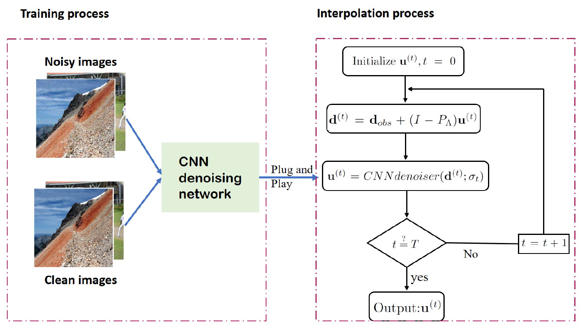

# CNN-POCS
 CNN-POCS algorithm for seismic data interpolation.

 This repository contains the reproducible code for the article ["Can learning from image denoising be used for seismic data interpolation?"](https://library.seg.org/doi/10.1190/geo2019-0243.1)  This article can also be reached at [Arxiv](https://arxiv.org/pdf/1902.10379.pdf) but it is somehow out of date.

## Requirements and Dependencies
This repository depends on Matlab and matconvnet. Matlab beyond 2018a and [matconvnet](https://www.vlfeat.org/matconvnet/) 1.0beta25 are recommended. CUDA is required for training process/gpu testing. Please refer to [Matlab GPU support](https://www.mathworks.com/help/parallel-computing/gpu-support-by-release.html) to setup your environment.
## CNN-POCS workflow

## Training
The training code can be found in [TrainingCodes](https://github.com/AlbertZhangHIT/CNN-POCS/tree/master/TrainingCodes).

## Seismic data interpolation
We provide demos for all the algorithm we use in our article. The pre-trained models on natural images are in folder [models](https://github.com/AlbertZhangHIT/CNN-POCS/tree/master/models). The hyperbolic events data and the synthetic 3D data are included in [seismicData](https://github.com/AlbertZhangHIT/CNN-POCS/tree/master/seismicData) for reproducing the results we obtain.

# Citation
If this repository helps you with your research work, please consider to cite our work as

	
	@article{zhang2020can,
	  title={Can learning from natural image denoising be used for seismic data interpolation?},
	  author={Zhang, Hao and Yang, Xiuyan and Ma, Jianwei},
	  journal={Geophysics},
	  volume={85},
	  number={4},
	  pages={1--142},
	  year={2020},
	  publisher={Society of Exploration Geophysicists}
	}
	